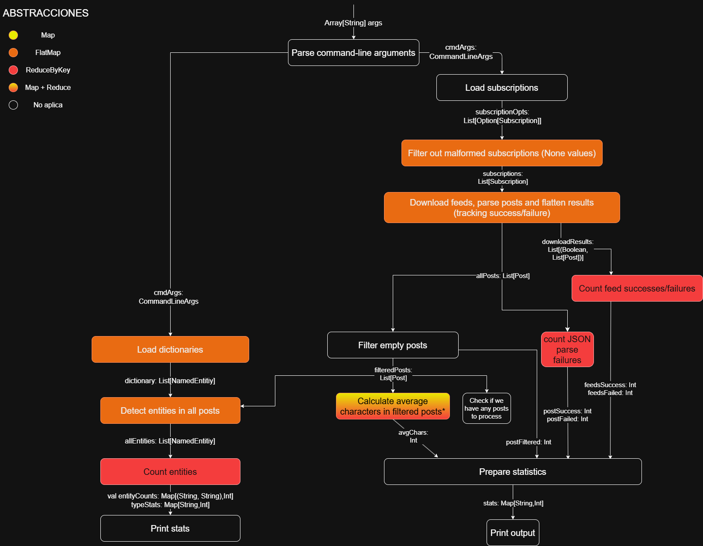
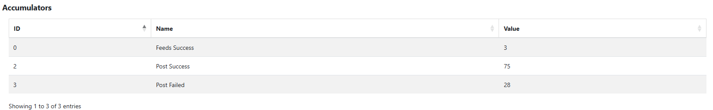
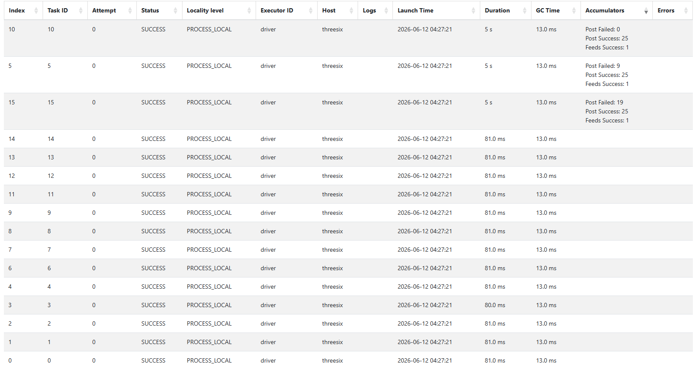
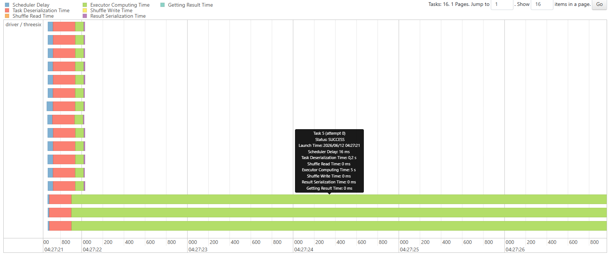

## Ejercicio 1

### a) Diagrama de flujo del pipeline

El pipeline de procesamiento de posts y detección de entidades puede representarse como un grafo de dependencias secuencial:



### b) Clasificación de pasos según abstracciones de Spark

| Paso del pipeline | Abstracción Spark | Justificación |
|---|---|---|
| Parse command-line arguments | No aplica / driver | Se ejecuta una sola vez sobre `Array[String]`, no sobre una colección distribuida. |
| Load subscriptions | No aplica o lectura de entrada | Es IO inicial. En Spark sería carga de datos, no `map`/`flatMap`/reducción propiamente. |
| Filter out malformed subscriptions | `flatMap` | En el código usa `flatten` sobre `List[Option[Subscription]]`: cada entrada produce 0 resultados si es `None`, 1 si es `Some`. Eso encaja con `flatMap`. |
| Download feeds, parse posts and flatten results (tracking success/failure) | `flatMap` | Cada `Subscription` produce exactamente un resultado: `(Boolean, List[Post])`. Cada suscripción se transforma en una lista de posts y luego todas esas listas se combinan en una única colección. |
| Count feed successes/failures | Reducción | Depende de todos los resultados de descarga. |
| Count JSON parse failures | Reducción | Usa `count(_._2.isEmpty)`, depende del conjunto completo de feeds. |
| Filter empty posts | No aplica / `filter` | En `Analyzer.filterEmptyPosts` usa `filter`. No encaja con las abstracciones propuestas. |
| Calculate average characters | `map` + reducción | Primero `map` transforma cada post en su largo; luego `sum` y `length` agregan todos los valores. No es solo `map` porque el promedio depende de todos los posts. |
| Check if we have any posts to process | Reducción / acción | `isEmpty` es una acción global: necesita saber si la colección completa tiene elementos. |
| Load dictionaries | No aplica / driver, o carga + `flatMap` si se distribuye | En este código se carga como dato auxiliar local. Si se modelara distribuido, leer múltiples archivos y unir entidades sería parecido a `flatMap`. |
| Detect entities in all posts | `flatMap` | Cada post puede producir cero, una o muchas entidades detectadas. El código lo hace explícitamente con `filteredPosts.flatMap`. |
| Count entities | `reduceByKey` | `Analyzer.countEntities` agrupa por `(entityType, text)` y cuenta. |
| Count entities by type | `reduceByKey` | Agrupa por `entityType` y cuenta. |
| Prepare statistics | No aplica / driver | Construye un `Map` pequeño con valores ya agregados. No transforma una colección distribuida. |
| Print output / Print stats | No aplica / acción final | Es salida por consola en el driver. |

### c) Barreras vs etapas independientes

Las **barreras de sincronización** son etapas donde se realizan agregaciones globales, puesto que necesitan esperar a que 
todos los workers terminen su trabajo antes de generar un resultado definitivo. Dentro de este pipeline, encontramos esto en 
los conteos y métricas (`count`, `length`) aplicados sobre `downloadResults`, `allPosts`, posts que han sido filtrados y las 
estadísticas de entidades (`countEntities`, `countByType`).

Las **etapas independientes** corresponden a transformaciones que ocurren localmente (`map`, `flatMap`), donde cada dato se 
transforma de manera aislada sin requerir ningún tipo de sincronización a escala global. Esto abarca desde la carga de 
suscripciones, pasando por la descarga de feeds, la extracción de posts hasta llegar a la detección de entidades.

### d) Restricciones sobre las funciones en entorno distribuido

Spark impone restricciones fundamentales sobre las funciones que se pasan a las transformaciones (`map`, `flatMap`, `reduceByKey`, etc.):

**Serializabilidad:** Toda función debe ser serializable para que Spark pueda enviarla a los workers a través de la red. En Scala, esto significa que la función no debe capturar objetos no serializables del entorno del driver.

**Ausencia de estado compartido mutable:** Las funciones no deben modificar variables fuera de su ámbito local. Spark puede ejecutar la" misma función múltiples veces en diferentes workers o incluso re-ejecutarla en caso de fallos, lo que causaría resultados inconsistentes.

**Efectos secundarios controlados:** Operaciones como `println` o escritura a archivos pueden ejecutarse múltiples veces o en workers remotos, haciendo que sus efectos sean impredecibles. Para logging controlado se usan logs de Spark o acumuladores.

**Determinismo:** La función debe producir la misma salida para la misma entrada, independientemente de cuándo o dónde se ejecute. Spark asume determinismo para optimizaciones y recuperación ante fallos.

**Consecuencia práctica:** No se puede usar `var` compartido, no se puede escribir en archivos desde workers (sin mecanismos especiales), y cualquier interacción con el mundo exterior debe ser idempotente o estar dentro de un contexto controlado.

## Ejercicio 2
Si la excepcion se propaga dentro del `flatMap`, falla la tarea que procesa esa particion y se puede reintentar hacerla , 
si continua el error, se aborta esa tarea. Al manejar la excepcion dentro del `flatMap`, evitamos que un feed fallido detenga 
el procesamiento del resto de los datos. 

## Ejercicio 3
### a) reduceByKey es una barrera de sincronización. ¿Qué ocurre en el cluster en ese punto? ¿Por qué es inevitable para este problema?

`reduceByKey` es una barrera de sincronización porque requiere que todos los workers terminen su trabajo antes de poder producir 
el resultado final. En este punto del pipeline ocurre lo siguiente:

1. **Etapa de shuffle (redistribución):** Cada worker produce pares `((tipo, nombre), 1)` de forma independiente.

2. **Etapa de reduce:** cada worker suma los valores de las entidades que le corresponden, produciendo el conteo total para cada clave.

3. **Sincronización obligatoria:** Antes de que el driver pueda leer el resultado, es necesario que todos los workers hayan completado 
   tanto el shuffle como la reducción de sus particiones.

Esto es **inevitable** para este problema porque el conteo total de cada entidad depende de **todos** los documentos procesados en 
el cluster. No es posible producir un conteo correcto hasta que se hayan visto todas las ocurrencias de una entidad en todos los 
feeds de todos los workers.

### b) ¿Qué restricciones debe cumplir la función que se le pasa a reduceByKey?

La función que se le pasa a `reduceByKey` debe cumplir dos propiedades fundamentales:

1. **Conmutatividad:** El orden en que se combinan los valores no debe importar. Como sumamos 
   conteos enteros, `a + b = b + a`, por lo que la función `_ + _` es conmutativa. Esto es crucial porque Spark no garantiza el 
   orden en que se procesan los datos.

2. **Asociatividad:** La forma en que se agrupan los valores no debe importar. Como sumamos, `(a + b) + c = a + (b + c)`, por lo que la función `_ + _` es asociativa. Esto permite que Spark combine resultados 
   intermedios sin preocuparse por la agrupación de las operaciones.

Si la función no cumpliera estas propiedades, la suma final sería incorrecta y dependería de factores externos como el orden de 
particionamiento o el número de workers.

### c) ¿Dónde se hace la lectura del diccionario de entidades? ¿En el driver o los workers?

La lectura del diccionario de entidades se realiza **en el driver** con la línea:

```scala
val dictionary = Dictionary.loadAll(cmdArgs.entitiesDir)
```


## Ejercicio 4

### a) ¿Por qué los Accumulators solo deben usarse para métricas y no para tomar decisiones lógicas dentro de las etapas distribuidas?

Los Accumulators solo deben usarse para **métricas** (no para lógica condicional) porque:

**Semántica "al menos una vez":** En caso de fallo de un worker y re-ejecución de una tarea, el acumulador puede incrementarse múltiples veces para la misma operación.

**Falta de consistencia en tiempo real:** El valor del acumulador no está disponible en los workers durante el procesamiento distribuido; solo el driver puede leerlo *después* de una acción terminal.

**Determinismo:** Si una decisión condicional dependiera del valor actual del acumulador, la re-ejecución de tareas (por tolerancia a fallos) produciría resultados no determinísticos.

**Ejemplo de uso incorrecto:** 
```scala
rdd.foreach { x =>
  if (accumulator.value < 100) {  // NO: value no está actualizado en workers
    process(x)
  }
}
```

**Ejemplo de uso correcto: Solo para conteo y agregación** 
```scala
rdd.foreach { x =>
  if (isValid(x)) accumulator.add(1)  // OK: solo acumula, no decide lógica
}
```

b) ¿En qué momento del pipeline está disponible el valor de un Accumulator para ser leído por el driver?
El valor de un acumulador está disponible solo después de una acción terminal (collect(), count(), saveAsTextFile(), etc.).

El driver no puede leer valores intermedios mientras los workers están procesando porque:

Los workers envían actualizaciones al driver de forma asíncrona

Spark no garantiza que todos los workers hayan completado su trabajo hasta la acción

En nuestro pipeline: Los acumuladores (accFeedsSuccess, accFeedsFailed, etc.) se leen correctamente después del primer collect() sobre downloadResults, que es la acción que fuerza la ejecución de todos los flatMap.

### c) Comparativa de tiempos: versión secuencial vs Spark

Para evaluar el rendimiento del pipeline se realizaron mediciones antes y después de aplicar persistencia mediante `cache()`.

#### Medición previa a la optimización con `cache()`

Sin utilizar persistencia, el procesamiento NER provocaba una nueva ejecución del pipeline completo, incluyendo la descarga de feeds.

| Etapa                        | Tiempo  |
| ---------------------------- | ------- |
| Descarga y filtrado de posts | 5,49 s  |
| Detección de entidades (NER) | 5,29 s  |
| Tiempo total                 | 12,14 s |

#### Medición luego de aplicar `cache()`

Tras persistir el RDD de posts válidos mediante:

```scala
downloadResults.cache()
```

los tiempos obtenidos fueron:

| Etapa                        | Tiempo |
| ---------------------------- | ------ |
| Descarga y filtrado de posts | 5,49 s |
| Detección de entidades (NER) | 0,33 s |
| Tiempo total                 | 7,08 s |

#### Análisis

La mayor parte del tiempo de ejecución corresponde a la descarga de los feeds y al parseo de las respuestas JSON obtenidas desde Reddit. Esta etapa depende principalmente de la latencia de red y del tiempo de respuesta de los servidores externos.

Por otro lado, la detección de entidades nombradas resultó muy rápida (0,33 segundos), ya que opera sobre un conjunto reducido de posts ya almacenados en memoria.

La diferencia entre ambas mediciones muestra claramente el efecto de la persistencia. Sin `cache()`, Spark volvía a ejecutar todo el pipeline cada vez que encontraba una nueva acción (`collect()`), lo que implicaba descargar nuevamente los feeds y reprocesar los posts. Al almacenar el RDD en memoria, las etapas posteriores reutilizan los datos ya calculados y evitan trabajo redundante.

#### Comparación conceptual con una versión secuencial

Dado que el laboratorio trabaja con un conjunto reducido de datos (3 feeds y aproximadamente 47 posts válidos luego del filtrado), es esperable que una implementación secuencial tenga tiempos similares o incluso menores que la versión Spark debido al overhead propio del framework:

* Inicialización del contexto Spark.
* Serialización y deserialización de datos.
* Planificación de tareas distribuidas.
* Comunicación entre driver y workers.

Sin embargo, Spark ofrece ventajas cuando el volumen de datos crece significativamente (miles de feeds o millones de posts), ya que puede distribuir el procesamiento entre múltiples núcleos o máquinas.

#### Conclusión

Para el tamaño de datos utilizado en este laboratorio, el beneficio de Spark en términos de rendimiento es limitado y el costo principal se encuentra en las operaciones de red. No obstante, Spark proporciona un modelo de programación distribuida escalable que permite procesar volúmenes de datos mucho mayores sin modificar significativamente la lógica de la aplicación.

La optimización mediante `cache()` redujo el tiempo total de ejecución de aproximadamente 12,14 segundos a 7,08 segundos, evitando recomputaciones innecesarias del pipeline y demostrando la importancia de la persistencia en aplicaciones Spark.

### Spark UI 
se observaron los acumuladores utilizados para medir el procesamiento distribuido. Durante la ejecución se registraron actualizaciones de:

- Feeds Success
- Post Success
- Post Failed

El acumulador Feeds Failed no presentó incrementos porque no ocurrieron errores de descarga durante la ejecución analizada.

Los valores observados por tarea coincidieron con las métricas finales mostradas por la aplicación:
3 feeds descargados correctamente, 75 posts procesados y 28 posts filtrados.





## Ejercicio 5 — Acceso a datos y estadísticas del resultado

### a) Puntos donde se recomputan operaciones innecesariamente

Sin la persistencia adecuada, el pipeline actual recomputa operaciones en los siguientes puntos:

| Operación                                               | Sin `cache()`                                      | Con `cache()`                                             |
| ------------------------------------------------------- | -------------------------------------------------- | --------------------------------------------------------- |
| `downloadResults.collect()`                             | Descarga todos los feeds (HTTP)                    | Descarga todos los feeds (HTTP) y los almacena en memoria |
| Cálculo de estadísticas (`avgChars`)                    | Utiliza datos ya recolectados en el driver         | Igual                                                     |
| Pipeline de NER (`flatMap` → `reduceByKey` → `collect`) | Vuelve a ejecutar toda la descarga y procesamiento | Utiliza el RDD cacheado                                   |

### Identificación en el código

```scala
// Primera acción terminal
val downloadResultsCollect = downloadResults.collect()

// Segunda acción terminal
val entityCounts = downloadResults
  .flatMap(...)
  .map(...)
  .reduceByKey(...)
  .collect()
```

Sin persistencia, Spark reconstruye completamente el RDD `downloadResults` para cada acción terminal, ejecutando nuevamente:

* Descarga de feeds.
* Parseo de JSON.
* Filtrado de posts vacíos.
* Actualización de acumuladores.

Por lo tanto, el pipeline se ejecuta dos veces sobre los mismos datos.

---

### b) Uso de `cache()`

Se agregó persistencia al RDD que contiene los posts válidos:

```scala
val downloadResults: RDD[Post] =
  rdd.flatMap { subscription =>
    // descarga y procesamiento
  }.cache()
```

### Justificación

El RDD `downloadResults` es utilizado por dos acciones terminales distintas:

1. `downloadResults.collect()`
2. `entityCounts.collect()`

Sin persistencia, ambas acciones provocarían una recomputación completa del pipeline.

Con `cache()`, la primera acción materializa el RDD y lo almacena en memoria. Las acciones posteriores reutilizan esos datos sin volver a descargar los feeds.

---

### c) Uso de `unpersist()`

Una vez utilizado el RDD cacheado, se libera explícitamente la memoria.

### Caso de error

```scala
if (downloadResultsCollect.isEmpty) {
  println("Error: No valid posts downloaded after filtering")
  downloadResults.unpersist()
  spark.stop()
  return
}
```

### Caso exitoso

```scala
downloadResults.unpersist()
```

### Justificación

Aunque Spark libera memoria automáticamente cuando la necesita, llamar a `unpersist()` permite indicar explícitamente que el RDD ya no será utilizado.

Esto evita ocupar memoria innecesariamente y constituye una buena práctica en aplicaciones distribuidas.

---

## Preguntas conceptuales

### ¿Qué ocurriría si no llamaran a `cache()`? ¿Cuántas veces se ejecutaría la descarga de feeds?

Sin `cache()`, Spark volvería a ejecutar todas las transformaciones necesarias para reconstruir el RDD cada vez que una acción terminal lo requiera.

En este pipeline existen dos acciones terminales que utilizan `downloadResults`:

1. `downloadResults.collect()`
2. `entityCounts.collect()`

Por lo tanto, la descarga de feeds se ejecutaría dos veces.

Con los datos del laboratorio:

* 3 feeds descargados en la primera ejecución.
* 3 feeds descargados nuevamente durante el procesamiento NER.

Total:

```text
6 descargas HTTP
```

En datasets grandes esto tendría un impacto importante tanto en tiempo de ejecución como en uso de red.

---

## ¿Por qué es incorrecto llamar a `collect()` entre los pasos a) y b) del ejercicio 3 y luego continuar el pipeline?

Un ejemplo incorrecto sería:

```scala
val posts = downloadResults.collect()

val entities =
  posts.flatMap(post => detectEntities(post, dictionary))
```

### Problemas

| Problema                 | Consecuencia                                      |
| ------------------------ | ------------------------------------------------- |
| Pérdida de paralelismo   | Todo el procesamiento ocurre en el driver         |
| Cuello de botella        | El driver procesa todos los datos                 |
| Mayor consumo de memoria | Todos los posts deben caber en memoria del driver |
| Workers ociosos          | Los workers dejan de participar                   |
| Menor escalabilidad      | El programa deja de aprovechar Spark              |

### Forma correcta

```scala
val entityCounts = downloadResults
  .flatMap(...)
  .map(...)
  .reduceByKey(...)
  .collect()
```

De esta manera todas las transformaciones se ejecutan distribuidamente y únicamente el resultado agregado final es enviado al driver.

### Conclusión

`collect()` debe utilizarse al final del pipeline para recuperar resultados ya procesados y agregados, no para trasladar datos intermedios al driver.

---

### `cache()` es también lazy. ¿En qué momento se almacena realmente el RDD en memoria?

Al igual que las transformaciones de Spark, `cache()` es una operación lazy.

Cuando se ejecuta:

```scala
val downloadResults = rdd.flatMap(...).cache()
```

Spark únicamente marca el RDD como persistente, pero todavía no almacena ningún dato.

La persistencia real ocurre cuando se ejecuta la primera acción terminal:

```scala
val downloadResultsCollect = downloadResults.collect()
```

En ese momento Spark:

1. Computa el RDD.
2. Almacena las particiones en memoria.
3. Devuelve el resultado solicitado.

Las acciones posteriores reutilizan directamente los datos cacheados:

```scala
val entityCounts = downloadResults
  .flatMap(...)
  .map(...)
  .reduceByKey(...)
  .collect()
```

En este segundo caso no es necesario volver a descargar los feeds ni reconstruir el RDD original.

### Secuencia de ejecución

| Paso                | Acción                        | Estado del cache |
| ------------------- | ----------------------------- | ---------------- |
| `cache()`           | Marca el RDD como persistente | Vacío            |
| Primer `collect()`  | Computa y almacena el RDD     | Cargado          |
| Segundo `collect()` | Reutiliza los datos cacheados | Cargado          |
| `unpersist()`       | Libera la memoria             | Vacío            |

---

### Resultado esperado

Luego de incorporar persistencia mediante `cache()`, cada etapa costosa del pipeline se ejecuta una sola vez.

| Operación              | Sin `cache()` | Con `cache()` |
| ---------------------- | ------------- | ------------- |
| Descarga de feeds      | 2 veces       | 1 vez         |
| Parseo de JSON         | 2 veces       | 1 vez         |
| Filtrado de posts      | 2 veces       | 1 vez         |
| Procesamiento NER      | 1 vez         | 1 vez         |
| Transferencia de datos | Mayor         | Menor         |

La persistencia reduce significativamente el tiempo total de ejecución, evita descargas redundantes y permite reutilizar eficientemente los resultados ya calculados por Spark.
